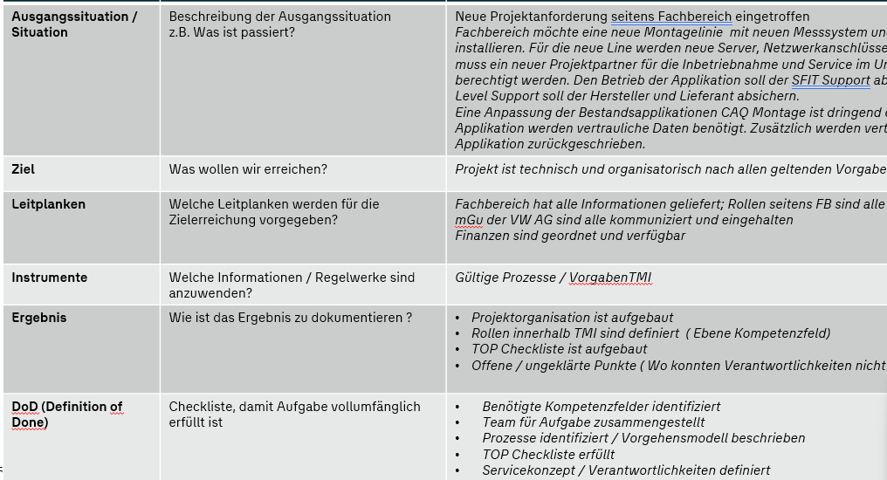
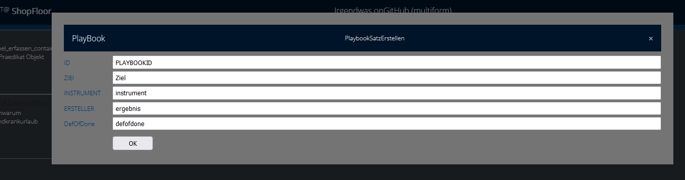
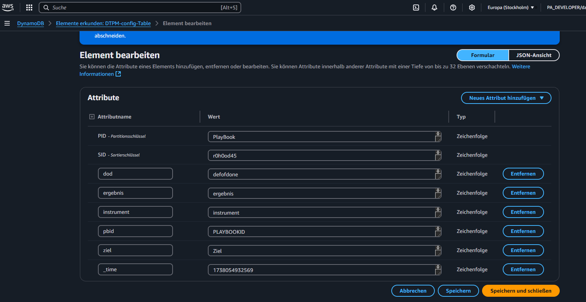

# playbook

how to use playbook story to interact with governance and team

beispiel




## playbook design


## playbook form

siehe multiform

```js
{ "ID"                : "PB0001"
, "angelegtAm"        : "2025-01-28" 
, "AusgangsSituation" : "neue Prrojektanforderung seitens Fachbereich"
, "Ziel"              : "Projekt annehmen und nach IT-PEP bewerten"
, "Leitplanken"       : "Finanz, Info Fachbereich"
, "Instrumente"       : "Prozesse nutzen Vorgaben"
, "Ergebnis"          : "Doku des Ergebnisses"
, "DefinitionOfDone"  : "Checkliste"
}
```

Dazu sollte ein SCHEMA entwickelt werden,

- welche Felder Pflichtfelder
- Felder ENUMs mit welchen Ausprägungen

Welche Anforderungen an Ablage/Peporting/Workflow
- betroffene Folgeprozesse
- Dokument-Vorlagen

wieviel Volumen fällt an

- 10 p.m.
- 1000 p.m.

Sind Events auf dem Haupt-Document zu tracken

- Versionierung
- Änderungen (wer muss wie davon Kenntnis bekommen)

## playbook ui

erfassung als formular

```js
  ,  "playbook" : { title   : "PlayBook"
                 , subtitle : "Playbook Satz erstellen"
                 , info     : "neueAnforderungentracken"
                 , form     : [ { l : "ID"        , v : "PLAYBOOK ID" , n : "pbid"       }
                              , { l : "ZIEl"      , v : "Ziel"        , n : "ziel"       }
                              , { l : "INSTRUMENT", v : "instrument"  , n : "instrument" }
                              , { l : "ERSTELLER" , v : "ergebnis"    , n : "ergebnis"   }
                              , { l : "DefOfDone" , v : "defofdone"   , n : "dod"        }
                              ]
                }
```

playbook erfassen

[playbook version 1.0](https://idsearch.github.io/multiform.html)



## Archtitektur

- static webserver over CORS to AWS Eventbridge Rule Stepfunction dynamoDB


